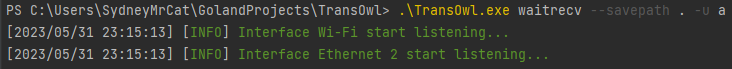

# README
 

TransOwl is currently a local network device discovery software, and may develop into a local network file transfer tool in the future.

TODOs:

- [ ] Add basic file transfer function via tcp
- [ ] [lz4](https://github.com/lz4/lz4) support
- [ ] Password protection

## Usage

[See here](./doc/TransOwl.md)

`./TransOwl waitrecv`

(use -u/--user to specify a username,--savepath is for future file transfer and is not available currently.)

`./TransOwl scandevices`

`waitrecv` should be ran with `sendfile` together but, since they're not fully featured, you can only use `scandevices` for scanning available devices. 

use `--verbose` or `--vverbose` to see more.

## CHANGELOG

v0.0.1: Initial version of TransOwl

## LICENSE

THIS IS A UNLICENSED SOFTWARE, SO 

Anyone is free to copy, modify, publish, use, compile, sell, or
distribute this software, either in source code form or as a compiled
binary, for any purpose, commercial or non-commercial, and by any
means.

SEE [LICENSE](./LICENSE) FOR MORE