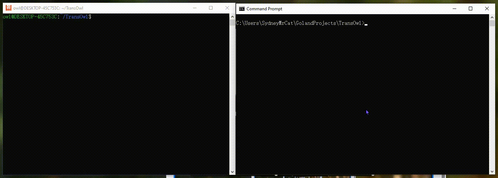

# README
 

TransOwl is currently a simple cross-platform local network device discovery tool, and is also a local network file transfer tool.

TODOs:

- [x] Add basic file transfer function via tcp
- [ ] Add support of large file(>=100M) transfer
- [ ] [lz4](https://github.com/lz4/lz4) support
- [ ] Password protection

## Usage

For detailed usage, plz [See here](./doc/TransOwl.md)

### Waitscan&Scandevices

`./TransOwl waitscan`

`WaitScan` acks request from `ScanDevices`

`./TransOwl scandevices`

`ScanDevices` scans devices in the same net segment.

### WaitRecv&SendFile

gif above indicates the usage of transowl.

TIPS: use `--verbose` or `--vverbose` to see more logs.

## CHANGELOG

v0.1.0: New function: File transfer(<100m). tested on windows 10 and ubuntu 18.04lts

v0.0.2: fix potential deadlock and added `waitscan`. file sending is still in process

v0.0.1: Initial version of TransOwl

## LICENSE

THIS IS A UNLICENSED SOFTWARE, SO 

Anyone is free to copy, modify, publish, use, compile, sell, or
distribute this software, either in source code form or as a compiled
binary, for any purpose, commercial or non-commercial, and by any
means.

SEE [LICENSE](./LICENSE) FOR MORE